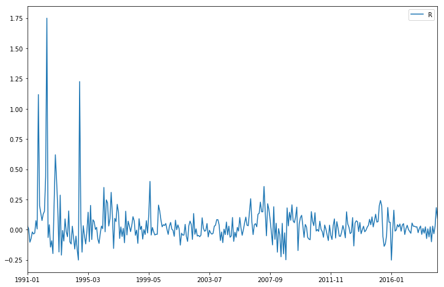
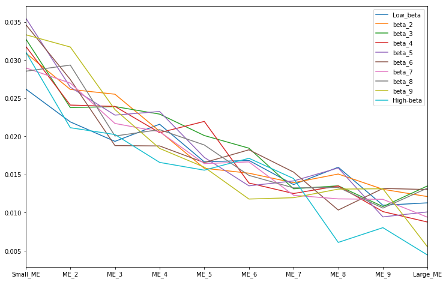
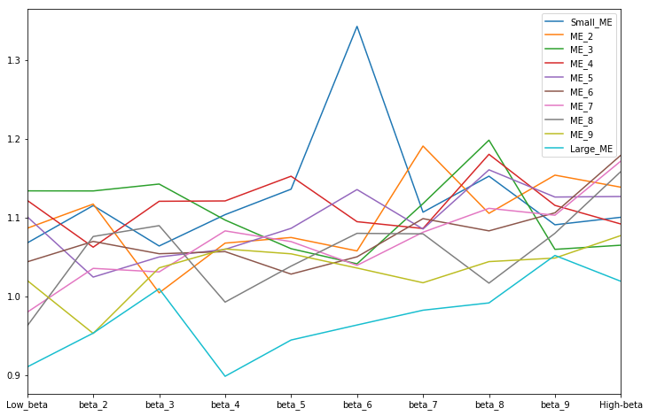
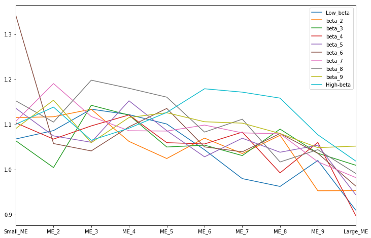
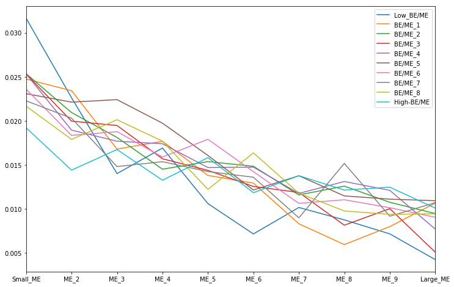
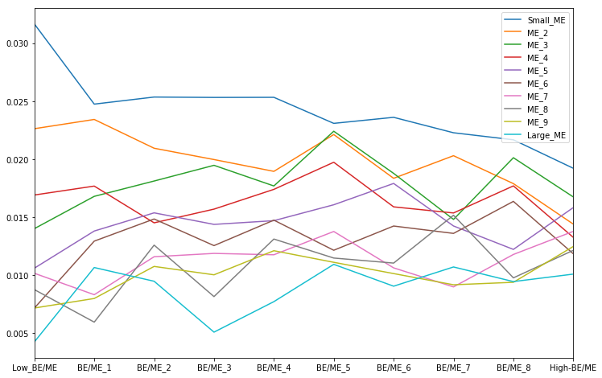

# 简介
Fama(1992)的论文*The Cross-Section of Expected Stock Returns*主要检验了1963-1990年美股股票收益率与市场$\beta$，公司规模，账面市值比，E/P之间的关系。结论是
1. 在控制公司规模的情况下市场$\beta$不能解释收益率
2. 公司规模、账面市值比能够解释收益率

这篇论文的神奇之处可能在于通过
1. 将所有股票按照公司规模的大小排序，按照十分位点划分为10组
2. 在上一步划分的所有组组内，均按照pre-ranking $\beta$大小排序，按照十分位划分为10小组，共得到一百小组

这个操作有效地分离了公司规模与市场$\beta$的影响。

这个代码的目的是使用中国股市的数据计算Fama(1992)年论文*The Cross-Section of Expected Stock Returns*中table I的三张panel以及table V。主要的问题包括但不限于没有使用FM regression（仅仅使用了OLS），以及函数写的我也觉得很混乱。

数据来源于国泰安数据库，主要使用了个股月收益率、无风险收益率以及财务报表数据。

主要的计算步骤为
1. 计算市场组合收益率
2. 按照size划分组合
3. 按照pre-ranking beta或者BE/ME划分组合
4. 记录各个组合每个月的数据
5. 对各个组合每个月的数据进行计算，画图。

使用到的变量名包括但不限于：
名称  | 描述
---  | ---
size  | 公司规模，使用ME或者ln(ME)表述
Market equity(ME) | 流通市值（股价*流通股数）
Book equity(BE) | 账面价值，这里使用的是所有者权益
pre-ranking beta | t年之前2-5年的股票收益率对上月市场收益率计算的$\beta$
post-ranking r | t年7月到t+1年6月组合等权重月度收益率（组合内所有股票的收益率均值）

table V 与 table I 步骤基本一致而且较为简单，故没有详细注释。

# 代码

```python
# 载入需要的包
import pandas as pd
import numpy as np
import matplotlib.pyplot as plt
import math
from patsy import dmatrices
from scipy.stats import f
import statsmodels.api as sm
from openpyxl import Workbook
```

## 计算市场组合收益率

```python
"""
* 市场收益率 Market Return:
    * 在原论文中描述为value-weighted portfolio of NYSE, AMEX, and (after 1972) NASDAQ stocks used as the proxy for the market
    * 在这里使用A股与创业板所有非金融股，按流通市值进行加权
"""
```

### 读取、整理数据

```python
# 读取数据

data = pd.read_excel('TRD_Mnth.xlsx')# 月个股交易数据
r0  = pd.read_excel('TRD_Nrrate.xlsx')# 无风险利率数据

# 整理数据
  # 由于无风险利率数据是每天都有的，这里留下各个月的最后一天的数据作为当月无风险利率
Y_M_D = r0['Clsdt'].str.split('-', expand=True)
Y_M_D['a']='-'
r0['Trdmnt'] = Y_M_D[0]+Y_M_D['a']+Y_M_D[1]
r0 = r0.dropna()
r0.drop_duplicates(subset=['Trdmnt'],keep='last',inplace=True)# 留下最后一天的数据
r0.head()

```

<div>
<style scoped>
    .dataframe tbody tr th:only-of-type {
        vertical-align: middle;
    }

    .dataframe tbody tr th {
        vertical-align: top;
    }

    .dataframe thead th {
        text-align: right;
    }
</style>
<table border="1" class="dataframe">
  <thead>
    <tr style="text-align: right;">
      <th></th>
      <th>Clsdt</th>
      <th>Nrrmtdt</th>
      <th>Trdmnt</th>
    </tr>
  </thead>
  <tbody>
    <tr>
      <th>2</th>
      <td>1990-04-15</td>
      <td>0.8035</td>
      <td>1990-04</td>
    </tr>
    <tr>
      <th>3</th>
      <td>1990-08-21</td>
      <td>0.693</td>
      <td>1990-08</td>
    </tr>
    <tr>
      <th>16</th>
      <td>1990-12-31</td>
      <td>0.693</td>
      <td>1990-12</td>
    </tr>
    <tr>
      <th>47</th>
      <td>1991-01-31</td>
      <td>0.693</td>
      <td>1991-01</td>
    </tr>
    <tr>
      <th>75</th>
      <td>1991-02-28</td>
      <td>0.693</td>
      <td>1991-02</td>
    </tr>
  </tbody>
</table>
</div>

```python
# 选出所有A股与创业板股票数据
data1 = data[(data.Markettype==1) | (data.Markettype==4) | (data.Markettype==16)]

# 保留交易日期，股票代码，月流通市值，月收益率，市场类型
data1 = data1[['Trdmnt','Stkcd','Msmvosd','Mretnd','Markettype']] 

# 获得所有日期
timelist = data1.drop_duplicates(['Trdmnt']) # 去掉重复日期
timelist = timelist.sort_values(by = ['Trdmnt'],ascending = True) # 对日期按照升序排列
timelist = timelist.Trdmnt
timelist = timelist.values # 提取日期的值

R = {} # 存放市场收益率的计算结果

# 后面要使用到ln(ME)
data1['ln(ME)'] = np.log(data1.Msmvosd.values)

```

### 计算组合收益率

```python
# 计算组合收益R
for t in range(1,len(timelist)): # 对于所有的日期t
    data_1 = data1[data1.Trdmnt == timelist[t]] # 提取t的数据
    data_1 = data_1.dropna() # 去掉没有收益率的股票
    
    # 获得所有股票代码
    namelist = data_1[["Stkcd"]] 
    namelist = namelist.Stkcd
    namelist = namelist.values
    
    # 获得总市值Sum
    Msmvosd = data_1.Msmvosd
    Msmvosd = Msmvosd.values
    Sum = sum(Msmvosd) 
    
    wr = sum(data_1.Mretnd*data_1.Msmvosd)/Sum # 加权平均
   
    R[timelist[t]] = wr # 存储t的市场组合收益

R_ = pd.DataFrame(R,index=['R']) # 将字典改为DataFrame
R_=R_.T # 转置
R_.plot(figsize=(12,8)) # 画图
```

    <matplotlib.axes._subplots.AxesSubplot at 0x276791d0>



```python
# 市场收益率-无风险收益率
R_ = R_.reset_index()
R_.rename(columns={'index': 'Trdmnt'}, inplace = True)
R_ = pd.merge(R_,r0,on = 'Trdmnt')
R_['R_'] = R_['R']-0.01*R_['Nrrmtdt'] # 计算市场收益率-无风险收益率
R_.head()
```

<div>
<style scoped>
    .dataframe tbody tr th:only-of-type {
        vertical-align: middle;
    }

    .dataframe tbody tr th {
        vertical-align: top;
    }

    .dataframe thead th {
        text-align: right;
    }
</style>
<table border="1" class="dataframe">
  <thead>
    <tr style="text-align: right;">
      <th></th>
      <th>Trdmnt</th>
      <th>R</th>
      <th>Clsdt</th>
      <th>Nrrmtdt</th>
      <th>R_</th>
    </tr>
  </thead>
  <tbody>
    <tr>
      <th>0</th>
      <td>1991-01</td>
      <td>0.030959</td>
      <td>1991-01-31</td>
      <td>0.693</td>
      <td>0.0240285</td>
    </tr>
    <tr>
      <th>1</th>
      <td>1991-02</td>
      <td>0.006214</td>
      <td>1991-02-28</td>
      <td>0.693</td>
      <td>-0.000716386</td>
    </tr>
    <tr>
      <th>2</th>
      <td>1991-03</td>
      <td>-0.104059</td>
      <td>1991-03-31</td>
      <td>0.693</td>
      <td>-0.110989</td>
    </tr>
    <tr>
      <th>3</th>
      <td>1991-04</td>
      <td>-0.073477</td>
      <td>1991-04-30</td>
      <td>0.6092</td>
      <td>-0.0795692</td>
    </tr>
    <tr>
      <th>4</th>
      <td>1991-05</td>
      <td>-0.019354</td>
      <td>1991-05-31</td>
      <td>0.6092</td>
      <td>-0.0254464</td>
    </tr>
  </tbody>
</table>
</div>

### 计算个股收益率-无风险收益率

```python
data1 = pd.merge(data1,r0,on = 'Trdmnt')
data1 = data1.dropna()
data1['R_r'] = data1['Mretnd']-0.01*data1['Nrrmtdt']
data1.head()
```

<div>
<style scoped>
    .dataframe tbody tr th:only-of-type {
        vertical-align: middle;
    }

    .dataframe tbody tr th {
        vertical-align: top;
    }

    .dataframe thead th {
        text-align: right;
    }
</style>
<table border="1" class="dataframe">
  <thead>
    <tr style="text-align: right;">
      <th></th>
      <th>Trdmnt</th>
      <th>Stkcd</th>
      <th>Msmvosd</th>
      <th>Mretnd</th>
      <th>Markettype</th>
      <th>Clsdt</th>
      <th>Nrrmtdt</th>
      <th>R_r</th>
    </tr>
  </thead>
  <tbody>
    <tr>
      <th>3</th>
      <td>1991-01</td>
      <td>600601</td>
      <td>223405.0</td>
      <td>0.017406</td>
      <td>1</td>
      <td>1991-01-31</td>
      <td>0.693</td>
      <td>0.010476</td>
    </tr>
    <tr>
      <th>4</th>
      <td>1991-01</td>
      <td>600602</td>
      <td>247955.0</td>
      <td>0.009798</td>
      <td>1</td>
      <td>1991-01-31</td>
      <td>0.693</td>
      <td>0.002868</td>
    </tr>
    <tr>
      <th>5</th>
      <td>1991-01</td>
      <td>600651</td>
      <td>13242.9</td>
      <td>0.000000</td>
      <td>1</td>
      <td>1991-01-31</td>
      <td>0.693</td>
      <td>-0.00693</td>
    </tr>
    <tr>
      <th>6</th>
      <td>1991-01</td>
      <td>600652</td>
      <td>1756.8</td>
      <td>0.062409</td>
      <td>1</td>
      <td>1991-01-31</td>
      <td>0.693</td>
      <td>0.055479</td>
    </tr>
    <tr>
      <th>8</th>
      <td>1991-01</td>
      <td>600654</td>
      <td>8353.8</td>
      <td>0.041089</td>
      <td>1</td>
      <td>1991-01-31</td>
      <td>0.693</td>
      <td>0.034159</td>
    </tr>
  </tbody>
</table>
</div>

### 建立提前一期的市场收益率

这是由于pre-ranking beta和post-ranking beta都是对上一个月的市场收益率进行回归。

虽然不是OLS回归，但是姑且先这样算着。

```python
# 处理市场回报率数据，建立提前一期的Index
R_1 = R_
time = R_1.Trdmnt.values
time = time[1:]
time = np.hstack([time,'0'])
R_1['t_1']=time
R_1.head()
```

<div>
<style scoped>
    .dataframe tbody tr th:only-of-type {
        vertical-align: middle;
    }

    .dataframe tbody tr th {
        vertical-align: top;
    }

    .dataframe thead th {
        text-align: right;
    }
</style>
<table border="1" class="dataframe">
  <thead>
    <tr style="text-align: right;">
      <th></th>
      <th>Trdmnt</th>
      <th>R</th>
      <th>Clsdt</th>
      <th>Nrrmtdt</th>
      <th>R_</th>
      <th>t_1</th>
    </tr>
  </thead>
  <tbody>
    <tr>
      <th>0</th>
      <td>1991-01</td>
      <td>0.030959</td>
      <td>1991-01-31</td>
      <td>0.693</td>
      <td>0.0240285</td>
      <td>1991-02</td>
    </tr>
    <tr>
      <th>1</th>
      <td>1991-02</td>
      <td>0.006214</td>
      <td>1991-02-28</td>
      <td>0.693</td>
      <td>-0.000716386</td>
      <td>1991-03</td>
    </tr>
    <tr>
      <th>2</th>
      <td>1991-03</td>
      <td>-0.104059</td>
      <td>1991-03-31</td>
      <td>0.693</td>
      <td>-0.110989</td>
      <td>1991-04</td>
    </tr>
    <tr>
      <th>3</th>
      <td>1991-04</td>
      <td>-0.073477</td>
      <td>1991-04-30</td>
      <td>0.6092</td>
      <td>-0.0795692</td>
      <td>1991-05</td>
    </tr>
    <tr>
      <th>4</th>
      <td>1991-05</td>
      <td>-0.019354</td>
      <td>1991-05-31</td>
      <td>0.6092</td>
      <td>-0.0254464</td>
      <td>1991-06</td>
    </tr>
  </tbody>
</table>
</div>

## 处理会计数据

部分使用的会计数据组成如下（指标为国泰安数据指标）

* BE：所有者权益合计FS_Combas['A003000000']+延递所得税资产FS_Combas['A001222000']
* A: 资产总计FS_Combas['A001000000']
* E/P: 利润总额FS_Comins['B001000000']/月个股流通市值TRD_Mnth['Msmvosd']
* ME: 月个股流通市值TRD_Mnth['Msmvosd']


```python
# 读取会计数据
a1 = pd.read_excel('G:\\yu\\OneDrive\\study\\4.2 portfolio management\
\\Task\\FM(1992)\\FS_Combas.xlsx')
a2 = pd.read_excel('G:\\yu\\OneDrive\\study\\4.2 portfolio management\
\\Task\\FM(1992)\\FS_Comins.xlsx')

# 整理会计数据
a = pd.merge(a1,a2, on = ['Stkcd','Accper'])
a.rename(columns={'A001222000':'d_taxes', 'A001000000':'A',\
                  'A003000000':'Equity','B001000000':'Earnings'}, inplace = True)
a = a[['Stkcd','Accper','d_taxes','A','Equity','Earnings']]

```

## 相关函数

### 回归数据要求

目标是筛选出符合加入t年回归的要求的股票的代码。参数是t年。输出含有股票代码的list。

```python
"""
回归数据要求A：
  如果要加入t年的回归，公司必须有t-1年12月和t年6月的股价
观察数据可知没有缺失值，均满足。
"""

"""
回归数据要求B:
  如果要加入t年的回归，公司必须有t年7月之前2-5年的数据
"""

def pre(t,data1=data):
    stocks = data1[data1.Trdmnt == timelist[t]]
    namelist = stocks.Stkcd.values
    namelist1 = [] # 存储符合的公司股票代码

    stocks = data1[(data1.Trdmnt<timelist[t])&\
        (data1.Trdmnt>timelist[max(0,t-60)])]
    for i in range(len(namelist)):
        stock = stocks[stocks.Stkcd == namelist[i]]
        if len(stock)>24:
            namelist1.append(namelist[i])
    return namelist1

"""
回归数据要求C:
  如果要加入t年的回归，公司必须有t-1年fiscal-yearend的
  totle book assets(A), book equity (BE), and earnings (E)
观察数据可知没有缺失值，均满足。
"""

```

### 回归
这里是简单的OLS回归。应该要改成FM regression。

```python
"""
回归
"""
def regression(x,y):
    x=np.array(x)
    y=np.array(y)
    X=sm.add_constant(x)
    model=sm.OLS(y.astype(float),X.astype(float))
    fit = model.fit()
    return fit
```

### 估计pre-ranking beta

这里的目标是输入很多股票的股票代码，与时间t，输出这些股票t年6月之前2-5年收益率对上月市场收益率回归得到的斜率。（调用了regression函数所以还是有FM regression的问题）输出的格式是含有股票代码与pre-ranking beta的dataframe。

```python
"""
估计pre-ranking beta
"""

def pre_r_beta(namelist,t):
    R_M = R_1[(R_1.t_1<timelist[t])&\
            (R_1.t_1>timelist[max(0,t-60)])]
    betas = {}
    for i in namelist:
        info = data1[data1.Stkcd == i]

        info = info[(info.Trdmnt<timelist[t])&\
            (info.Trdmnt>timelist[max(0,t-60)])]

        info = pd.merge(R_M,info,right_on = 'Trdmnt',left_on = 't_1')
        info = info.dropna()
        y = info[['R_r']]
        x = info[['R_']]
        beta = regression(x,y)
        beta = beta.params
        beta = beta[1]
        betas[i] = beta
    betas = pd.DataFrame(betas,index=['beta']) # 将字典改为DataFrame
    betas =betas.T # 转置
    betas = betas.reset_index()
    betas.rename(columns={'index': 'Stkcd'}, inplace = True)

    return betas
```

### 分组

计算十分位作为breakpoints。输入含有分组指标的dataframe。输出以十分位为键，十分位点为值的字典。

```python
"""
计算breakpoints
"""
def Breakpoints(index):
    breakpoints = {}
    for i in range(1,10):
        breakpoint = index.quantile(0.1*i)
        breakpoints[i] = breakpoint
    return breakpoints
```

按照上面输出的分位点进行分组。输入Breakpoints的结果，需要分组的dataframe，以及分组的指标名，输出以十分位为键，对应的dataframe为值的字典。

```python
"""
按breakpoints进行划分
"""
def Group(breakpoints, target, factor):
    group = {}
    group[0] = target[target[factor] < breakpoints[1]]
    for i in range(1,len(breakpoints)+1):
        if i != len(breakpoints):
            group[i] = target[(target[factor] > breakpoints[i])&\
                              (target[factor] < breakpoints[i+1])] 
        else:
            group[i] = target[target[factor] > breakpoints[i]]
    return group
```

## 生成股票组合

由于经历了两次分组得到了组合，但是每年进行一次分组，每月都需要更新数据。因此需要提取分组的股票代码，生成不同时间的股票组合。

```python
"""
得到二次分组的股票代码
"""
def Stockid(subgroup):
    stockid = {}
    for i in range(len(subgroup)):
        stockid[i]={}
        for j in range(len(subgroup[i])):
            ids = subgroup[i][j]
            ids = ids.Stkcd.values
            stockid[i][j] = ids
    return stockid
```


```python
"""
生成二次分组的股票组合
"""
def Portfolio(t1,stockid):
    stocks_info = {}
    stocks = data1[data1.Trdmnt == timelist[t1]]
    for i in range(len(stockid)):
            stocks_info[i]={}
            for j in range(len(stockid[i])):
                stock_info = stocks[stocks.Stkcd == int(stockid[i][j][0])]
                for k in range(1, len(stockid[i][j])):
                    stock_info = stock_info.append(stocks[stocks.Stkcd == int(stockid[i][j][k])])
                stocks_info[i][j]=stock_info
    return stocks_info
```

## 分组，记录月度数据

```python
# 建立用于存储月度数据的字典
post_r_R = {}
average_size = {}

for i in range(10):
    post_r_R[i]={}
    average_size[i]={}
    for j in range(10):
        post_r_R[i][j]={}
        average_size[i][j]={}

# 开始分组与记录
for t in range(186, len(timelist),12):
    # 考虑到股权分置改革的影响，从2006-06开始
    print(timelist[t])
    namelist = pre(t)

    stocks = data1[data1.Trdmnt == timelist[t]]

    # 先按size分组
    target = stocks[stocks.Stkcd == int(namelist[0])]
    for i in range(1,len(namelist)):
        target = target.append(stocks[stocks.Stkcd == int(namelist[i])])

    index = target[(target.Markettype == 1)|(target.Markettype == 4)]
    index = target.Msmvosd
    breakpoints = Breakpoints(index)

    group = Group(breakpoints, target, "Msmvosd")

    # 再按pre-ranking beta分组
    subgroup = {}
    for num in range(len(group)):
        i = group[num]
        namelist = i.Stkcd.values
        betas = pre_r_beta(namelist, t)
        info = pd.merge(betas,stocks,on='Stkcd')
        index = info[(info.Markettype == 1)|(info.Markettype == 4)]
        index = betas.beta

        breakpoints = Breakpoints(index)
        subgroup[num] = Group(breakpoints, info, "beta")

    # 得到分组的股票代码
    stockid = Stockid(subgroup)

    # 记录每个月的数据
    for i in range(1,13):
        t1 = t+i
        portfolio = Portfolio(t1,stockid)
        for i in range(10):
            for j in range(10):
                p = portfolio[i][j]
                r = p.R_r
                size = p['ln(ME)']
                post_r_R[i][j][timelist[t1]] = r.mean()
                average_size[i][j][timelist[t1]] = size.mean()
```

    2006-06
    2007-06
    2008-06
    2009-06
    2010-06
    2011-06
    2012-06
    2013-06
    2014-06
    2015-06
    2016-06
    2017-06
    2018-06
    


    ---------------------------------------------------------------------------

    IndexError                                Traceback (most recent call last)

    <ipython-input-77-2b702a611c80> in <module>
         33     for i in range(1,13):
         34         t1 = t+i
    ---> 35         portfolio = Portfolio(t1,stockid)
         36         for i in range(10):
         37             for j in range(10):
    

    <ipython-input-28-409794f65b2f> in Portfolio(t1, stockid)
          4 def Portfolio(t1,stockid):
          5     stocks_info = {}
    ----> 6     stocks = data1[data1.Trdmnt == timelist[t1]]
          7     for i in range(len(stockid)):
          8             stocks_info[i]={}
    

    IndexError: index 340 is out of bounds for axis 0 with size 340


对于以上报错，因为数据只到2019-03，所以是很正常的。没有影响。

## 计算，画图

### Table I: Panel A

```python
"""
    Panel A:  计算R_m的时间序列平均
"""
average_R_m = {}
for i in range(len(post_r_R)):
    average_R_m[i] = {}
    for j in range(len(post_r_R[i])):
        data = data = post_r_R[i][j]
        data = pd.DataFrame(data,index=['R_m']) # 将字典改为DataFrame
        data = data.T # 转置
        data = data.R_m
        average = data.mean()
        
        average_R_m[i][j] = average

# 按照low beta 到 high beta进行划分
beta_index={}
for i in range(1,9):
    beta_index[i] = 'beta_'+str(i+1)
beta_index[0] = 'Low_beta'
beta_index[9] = 'High-beta'

# 按照small size 到 large size进行划分
size_index={}
for i in range(1,9):
    size_index[i] = 'ME_'+str(i+1)
size_index[0] = 'Small_ME'
size_index[9] = 'Large_ME'

# 处理数据
average_R_m_ = pd.DataFrame(average_R_m) # 将字典改为DataFrame
average_R_m_.rename(columns=size_index, inplace = True)
average_R_m_=average_R_m_.T # 转置
average_R_m_.rename(columns=beta_index, inplace = True)
average_R_m_.plot(figsize=(12,8)) # 画图
```

    <matplotlib.axes._subplots.AxesSubplot at 0x1f3963c8>



```python
average_R_m_=average_R_m_.T
average_R_m_.plot(figsize=(12,8)) # 画图

average_R_m_=average_R_m_.T
average_R_m_.head(10)
```

<div>
<style scoped>
    .dataframe tbody tr th:only-of-type {
        vertical-align: middle;
    }

    .dataframe tbody tr th {
        vertical-align: top;
    }

    .dataframe thead th {
        text-align: right;
    }
</style>
<table border="1" class="dataframe">
  <thead>
    <tr style="text-align: right;">
      <th></th>
      <th>Low_beta</th>
      <th>beta_2</th>
      <th>beta_3</th>
      <th>beta_4</th>
      <th>beta_5</th>
      <th>beta_6</th>
      <th>beta_7</th>
      <th>beta_8</th>
      <th>beta_9</th>
      <th>High-beta</th>
    </tr>
  </thead>
  <tbody>
    <tr>
      <th>Small_ME</th>
      <td>0.026222</td>
      <td>0.030938</td>
      <td>0.032805</td>
      <td>0.031822</td>
      <td>0.035534</td>
      <td>0.034678</td>
      <td>0.028982</td>
      <td>0.028537</td>
      <td>0.033326</td>
      <td>0.031102</td>
    </tr>
    <tr>
      <th>ME_2</th>
      <td>0.021896</td>
      <td>0.026157</td>
      <td>0.023767</td>
      <td>0.024102</td>
      <td>0.026446</td>
      <td>0.027456</td>
      <td>0.026984</td>
      <td>0.029345</td>
      <td>0.031713</td>
      <td>0.021133</td>
    </tr>
    <tr>
      <th>ME_3</th>
      <td>0.019342</td>
      <td>0.025525</td>
      <td>0.023904</td>
      <td>0.023924</td>
      <td>0.022784</td>
      <td>0.018790</td>
      <td>0.021691</td>
      <td>0.020044</td>
      <td>0.023510</td>
      <td>0.020236</td>
    </tr>
    <tr>
      <th>ME_4</th>
      <td>0.021588</td>
      <td>0.020667</td>
      <td>0.022917</td>
      <td>0.020483</td>
      <td>0.023259</td>
      <td>0.018743</td>
      <td>0.020605</td>
      <td>0.020876</td>
      <td>0.018419</td>
      <td>0.016585</td>
    </tr>
    <tr>
      <th>ME_5</th>
      <td>0.016660</td>
      <td>0.015818</td>
      <td>0.020108</td>
      <td>0.021958</td>
      <td>0.017246</td>
      <td>0.016558</td>
      <td>0.016432</td>
      <td>0.018872</td>
      <td>0.015960</td>
      <td>0.015566</td>
    </tr>
    <tr>
      <th>ME_6</th>
      <td>0.016846</td>
      <td>0.015170</td>
      <td>0.018450</td>
      <td>0.013881</td>
      <td>0.013512</td>
      <td>0.018238</td>
      <td>0.016649</td>
      <td>0.014883</td>
      <td>0.011781</td>
      <td>0.017125</td>
    </tr>
    <tr>
      <th>ME_7</th>
      <td>0.013679</td>
      <td>0.013921</td>
      <td>0.013124</td>
      <td>0.012507</td>
      <td>0.014156</td>
      <td>0.015310</td>
      <td>0.012279</td>
      <td>0.013247</td>
      <td>0.011957</td>
      <td>0.014469</td>
    </tr>
    <tr>
      <th>ME_8</th>
      <td>0.015952</td>
      <td>0.015061</td>
      <td>0.013517</td>
      <td>0.013498</td>
      <td>0.015856</td>
      <td>0.010339</td>
      <td>0.011803</td>
      <td>0.013307</td>
      <td>0.013084</td>
      <td>0.006095</td>
    </tr>
    <tr>
      <th>ME_9</th>
      <td>0.010965</td>
      <td>0.013061</td>
      <td>0.010792</td>
      <td>0.010133</td>
      <td>0.009440</td>
      <td>0.013170</td>
      <td>0.011741</td>
      <td>0.010596</td>
      <td>0.013128</td>
      <td>0.008027</td>
    </tr>
    <tr>
      <th>Large_ME</th>
      <td>0.011283</td>
      <td>0.012101</td>
      <td>0.013507</td>
      <td>0.008763</td>
      <td>0.010093</td>
      <td>0.013029</td>
      <td>0.009395</td>
      <td>0.013224</td>
      <td>0.005498</td>
      <td>0.004434</td>
    </tr>
  </tbody>
</table>
</div>


### Table I: Panel B
```python
"""
    Panel B: 将R_m对上个月的市场收益率进行回归
"""

post_r_betas = {}
for i in range(len(post_r_R)):
    post_r_betas[i] = {}
    for j in range(len(post_r_R[i])):
        data = post_r_R[i][j]
        data = pd.DataFrame(data,index=['R_m']) # 将字典改为DataFrame
        data = data.T # 转置
        data = data.reset_index()
        data.rename(columns={'index': 'Trdmnt'}, inplace = True)
        data = pd.merge(R_1,data,right_on = 'Trdmnt',left_on = 't_1')
        data = data.dropna()
        y = data[['R_m']]
        x = data[['R_']]
        beta = regression(x,y)
        beta = beta.params
        beta = beta[1]
        post_r_betas[i][j] = beta

post_r_betas_ = pd.DataFrame(post_r_betas) # 将字典改为DataFrame
post_r_betas_.rename(columns=size_index, inplace = True)
post_r_betas_=post_r_betas_.T # 转置
post_r_betas_.rename(columns=beta_index, inplace = True)
print(post_r_betas_)
```

              Low_beta    beta_2    beta_3    beta_4    beta_5    beta_6  \
    Small_ME  1.067522  1.114942  1.063655  1.103420  1.135744  1.342384   
    ME_2      1.086176  1.116852  1.004191  1.067298  1.074430  1.057394   
    ME_3      1.133621  1.133514  1.142273  1.096577  1.060221  1.041033   
    ME_4      1.121526  1.062153  1.120393  1.120835  1.152226  1.094487   
    ME_5      1.100725  1.024188  1.049727  1.059372  1.086048  1.135262   
    ME_6      1.043541  1.069441  1.053820  1.056509  1.027971  1.049932   
    ME_7      0.979606  1.035245  1.030737  1.082822  1.069219  1.039091   
    ME_8      0.962260  1.075692  1.089484  0.992435  1.038118  1.079713   
    ME_9      1.019866  0.952719  1.035909  1.059861  1.053700  1.035683   
    Large_ME  0.910164  0.953049  1.009419  0.898298  0.944319  0.963403   
    
                beta_7    beta_8    beta_9  High-beta  
    Small_ME  1.106542  1.152268  1.090578   1.100104  
    ME_2      1.190480  1.105094  1.153565   1.138260  
    ME_3      1.117432  1.197964  1.059390   1.064639  
    ME_4      1.085840  1.180015  1.115188   1.091543  
    ME_5      1.085168  1.160330  1.125771   1.126462  
    ME_6      1.098363  1.082852  1.105774   1.178939  
    ME_7      1.081126  1.111443  1.102691   1.171476  
    ME_8      1.079074  1.016531  1.079757   1.158187  
    ME_9      1.016994  1.043829  1.048327   1.076939  
    Large_ME  0.982154  0.991411  1.051671   1.018840  
    
```python
post_r_betas_.T.plot(figsize=(12,8)) # 画图
```


    <matplotlib.axes._subplots.AxesSubplot at 0x1f61dbe0>





```python
post_r_betas_.plot(figsize=(12,8)) # 画图
```


    <matplotlib.axes._subplots.AxesSubplot at 0x1ee60f60>




### Table I: Panel C

```python
"""
    Panel C: 计算average_size的时间序列平均
"""
Average_size = {}
for i in range(len(average_size)):
    Average_size[i] = {}
    for j in range(len(average_size[i])):
        data = average_size[i][j]
        data = pd.DataFrame(data,index=['size']) # 将字典改为DataFrame
        data = data.T # 转置
        data = data[['size']]
        average = data.mean()
        Average_size[i][j] = float(average)
```


```python
def visualize(post_r_betas):
    post_r_betas_ = pd.DataFrame(post_r_betas) # 将字典改为DataFrame
    post_r_betas_.rename(columns=size_index, inplace = True)
    post_r_betas_=post_r_betas_.T # 转置
    post_r_betas_.rename(columns=beta_index, inplace = True)
    post_r_betas_.plot(figsize=(12,8)) # 画图
```


```python
visualize(Average_size)
```


```python
Average_size_ = pd.DataFrame(Average_size) # 将字典改为DataFrame
Average_size_.rename(columns=size_index, inplace = True)
Average_size_=Average_size_.T # 转置
Average_size_.rename(columns=beta_index, inplace = True)
print(Average_size_)
```

### Table V

#### 整理数据

```python
# 整理数据
a.isnull().any() # 观察有哪些数据缺失
a.d_taxes = a.d_taxes.fillna(0) # 延递所得税缺失影响不大，填0
a.Earnings = a.Earnings.fillna(0) # 没有用到Earnings，填0
a = a.dropna() # 其他数据缺失就不要了

# 计算BE
a['BE'] = a['Equity']+a["d_taxes"]

# 整理数据
a_ = a
Y_M_D = a_['Accper'].str.split('-', expand=True)
Y_M_D['a']='-'
a_['Trdmnt'] = Y_M_D[0]+Y_M_D['a']+Y_M_D[1]
a_=a_.dropna() # 去掉第一二行的无用文字
del a_['Accper'] # 去掉Y-M-D的会计期间
a_['Stkcd'] = pd.to_numeric(a_['Stkcd'])
a_ = pd.merge(a_,data1,on = ['Stkcd','Trdmnt']) # 与月度收益率进行合并
a_.head()
```


<div>
<style scoped>
    .dataframe tbody tr th:only-of-type {
        vertical-align: middle;
    }

    .dataframe tbody tr th {
        vertical-align: top;
    }

    .dataframe thead th {
        text-align: right;
    }
</style>
<table border="1" class="dataframe">
  <thead>
    <tr style="text-align: right;">
      <th></th>
      <th>Stkcd</th>
      <th>d_taxes</th>
      <th>Equity</th>
      <th>Earnings</th>
      <th>BE</th>
      <th>Trdmnt</th>
      <th>Msmvosd</th>
      <th>Mretnd</th>
      <th>Markettype</th>
      <th>ln(ME)</th>
    </tr>
  </thead>
  <tbody>
    <tr>
      <th>0</th>
      <td>2</td>
      <td>0</td>
      <td>1.9066e+08</td>
      <td>0</td>
      <td>1.9066e+08</td>
      <td>1991-12</td>
      <td>1076671.20</td>
      <td>0.120588</td>
      <td>4</td>
      <td>13.889385</td>
    </tr>
    <tr>
      <th>1</th>
      <td>2</td>
      <td>0</td>
      <td>2.37209e+08</td>
      <td>7.91597e+07</td>
      <td>2.37209e+08</td>
      <td>1992-12</td>
      <td>1675198.63</td>
      <td>0.112613</td>
      <td>4</td>
      <td>14.331442</td>
    </tr>
    <tr>
      <th>2</th>
      <td>2</td>
      <td>0</td>
      <td>9.30305e+08</td>
      <td>1.79155e+08</td>
      <td>9.30305e+08</td>
      <td>1993-12</td>
      <td>1826102.14</td>
      <td>0.101227</td>
      <td>4</td>
      <td>14.417694</td>
    </tr>
    <tr>
      <th>3</th>
      <td>2</td>
      <td>0</td>
      <td>1.14789e+09</td>
      <td>2.18501e+08</td>
      <td>1.14789e+09</td>
      <td>1994-12</td>
      <td>769591.88</td>
      <td>-0.032258</td>
      <td>4</td>
      <td>13.553616</td>
    </tr>
    <tr>
      <th>4</th>
      <td>2</td>
      <td>0</td>
      <td>1.17271e+09</td>
      <td>6.68561e+08</td>
      <td>1.17271e+09</td>
      <td>1995-06</td>
      <td>659640.72</td>
      <td>-0.033932</td>
      <td>4</td>
      <td>13.399451</td>
    </tr>
  </tbody>
</table>
</div>


```python
a_['BE/ME'] = a_['BE']/a_['Msmvosd']
```

#### 分组，记录数据

```python
V_R = {}
for i in range(10):
    V_R[i]={}
    for j in range(10):
        V_R[i][j]={}
        
for t in range(90, len(timelist),12):
    # 从1998年6月开始
    print(timelist[t])
    namelist = pre(t)

    stocks = a_[a_.Trdmnt == timelist[t]]

    # 先按size分组
    target = stocks[stocks.Stkcd == int(namelist[0])]
    for i in range(1,len(namelist)):
        target = target.append(stocks[stocks.Stkcd == int(namelist[i])])

    index = target.Msmvosd
    
    breakpoints = Breakpoints(index)

    group = Group(breakpoints, target, "Msmvosd")
    
    a_i = a_[a_.Trdmnt == timelist[t-6]]

    # 再按BE/ME分组
    subgroup = {}
    for num in range(len(group)):
        i = group[num]
        namelist = i.Stkcd.values
        target = a_i[a_i.Stkcd == int(namelist[0])]
        for j in range(1,len(namelist)):
            target = target.append(a_i[a_i.Stkcd == int(namelist[j])])

        index = target['BE/ME']

        breakpoints = Breakpoints(index)
        subgroup[num] = Group(breakpoints, target, "BE/ME")

    stockid = Stockid(subgroup)
    for i in range(1,13):
        t1 = t+i
        portfolio = Portfolio(t1,stockid)
        for i in range(10):
            for j in range(10):
                p = portfolio[i][j]
                r = p.Mretnd
                V_R[i][j][timelist[t1]] = r.mean()
```

    1998-06
    1999-06
    2000-06
    2001-06
    2002-06
    2003-06
    2004-06
    2005-06
    2006-06
    2007-06
    2008-06
    2009-06
    2010-06
    2011-06
    2012-06
    2013-06
    2014-06
    2015-06
    2016-06
    2017-06
    2018-06
    


    ---------------------------------------------------------------------------

    IndexError                                Traceback (most recent call last)

    <ipython-input-120-80248e84acfa> in <module>
         42     for i in range(1,13):
         43         t1 = t+i
    ---> 44         portfolio = Portfolio(t1,stockid)
         45         for i in range(10):
         46             for j in range(10):
    

    <ipython-input-19-409794f65b2f> in Portfolio(t1, stockid)
          4 def Portfolio(t1,stockid):
          5     stocks_info = {}
    ----> 6     stocks = data1[data1.Trdmnt == timelist[t1]]
          7     for i in range(len(stockid)):
          8             stocks_info[i]={}
    

    IndexError: index 340 is out of bounds for axis 0 with size 340


```python
"""
Table 5
"""
# 计算R_m的时间序列平均

average_R_m = {}
for i in range(len(post_r_R)):
    average_R_m[i] = {}
    for j in range(len(post_r_R[i])):
        data = V_R[i][j]
        data = pd.DataFrame(data,index=['R_m']) # 将字典改为DataFrame
        data = data.T # 转置
        data = data.R_m
        average = data.mean()
        
        average_R_m[i][j] = average

BEME_index={}
BEME_index[1] = 'BE/ME_1'
BEME_index[2] = 'BE/ME_2'
BEME_index[3] = 'BE/ME_3'
BEME_index[4] = 'BE/ME_4'
BEME_index[5] = 'BE/ME_5'
BEME_index[6] = 'BE/ME_6'
BEME_index[7] = 'BE/ME_7'
BEME_index[8] = 'BE/ME_8'

BEME_index[0] = 'Low_BE/ME'
BEME_index[9] = 'High-BE/ME'

average_R_m_ = pd.DataFrame(average_R_m) # 将字典改为DataFrame
average_R_m_.rename(columns=size_index, inplace = True)
average_R_m_=average_R_m_.T # 转置
average_R_m_.rename(columns=BEME_index, inplace = True)
average_R_m_.plot(figsize=(12,8)) # 画图
```

    <matplotlib.axes._subplots.AxesSubplot at 0x1b40e908>



```python
average_R_m_.T.plot(figsize=(12,8)) # 画图
```

    <matplotlib.axes._subplots.AxesSubplot at 0x1b44ac88>

